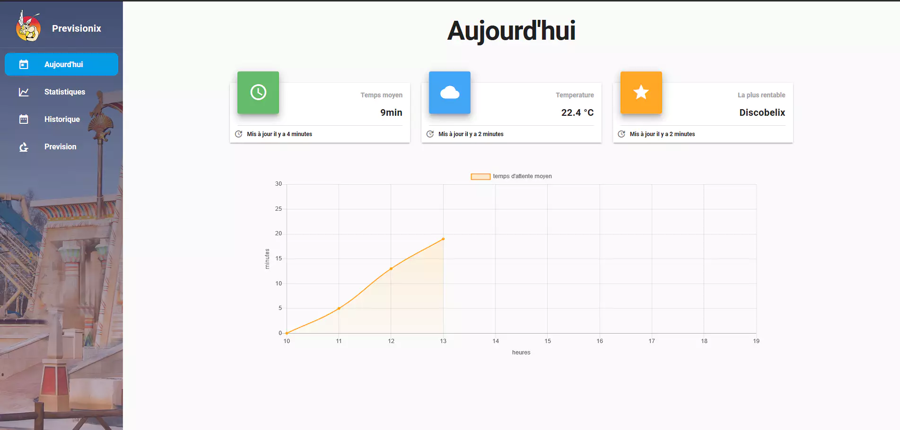

## Previsionix

Data analysis of parc Asterix queue time. It uses workers to gather the queue time and some weather informations. It then uses the day of the week, month, weather data and the queuetime to try and guess the best time to go in the week using machine learning.
You can also see all the data collected on the frontend.

## Technos

Python (aiohttp)
Vue.Js
Postgresql

## Screenshots

## How do I get the queuetime ?

The queuetime is not publicly exposed by parc asterix. They have an app that exposes them. So I tried to get the url of the api that the official app uses. I first tried to look at the packets but they were encrypted using https, so I was unable to see the url endpoint. To counter this, I installed a fake certficate on my phone to Man In The Middle my own phone and was able to retrieve the url that the app uses. Few years later they changed the url and with more recent Android update I could not do the same tricks, so I closed the website down but it was a fun side projet.